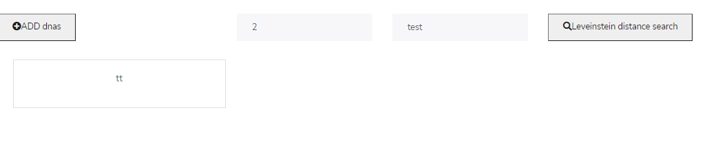

### 1.2 Suppose you had to turn this into an API consumed by many users. What would you need to add/modify in order to achieve it?
- Documentation
- scalability
- Exactly What a User Need With Schema Filtering
- Defining Specific Responses Using The Prefer Header
- More Efficiency Through Compression
- Breaking Things Down With Chunked Responses
- Using Caching To Make Response
- Friendly : handle error + provide lots of details
- API endpoints are cross site request enabled, hence can be called directly from browsers
- Layered system : deploy the API on server A, and store data on server B and authenticate requests in Server C, for example. A user cannot ordinarily tell whether it is connected directly to the end server or an intermediary along the way.
### 2.1 You need to design an architecture were the same input data be processed by different algorithms and according to different input parameters (i.e. same input and output types but different implementations). The parameters and algorithms can only be known at run- time (e.g. because they depend on user input)
 - What would be your design considerations?
 - Design an archotecture that give us the possibility to annotate our services and input/output parameters in a structured and identifiable manner, based on a standard JSON-LD . By indexing and visualizing these descriptions as Linked Data in a Elasticsearch back-end, we can seamlessly identify the services that consume or return desired parameters, and automatically compose services in workflows that yield new insights.Also we would need to have input validation on the application level to provide json logging for all inputs/outputs.
### 2.2 What could be a possible high-level architecture that satisfies the requirements above? (Just a sketch is fine)

## Run the app 

### Setup DB

1. You need to install Mysql
2. you can find the DB details under `database/database.sql`
    1. Create schema enpicom
    2. create table dnas ( id: int, string: varchar )

### Run app locally

- install project dependencies both under /client , /server `npm install`
- `npm run dev` - Under /server This will start the server application in development mode
- `npm start` - Under /client, This will start the application on port 4200

## Features
- CRUD operations for dnas
- REST API Request object validations - Basic
- Test e2e 

## REST Services

The application exposes 3 rest REST endpoints

`HTTP` `GET` /api/dnas ( for Levenshtein Distance )

`HTTP` `GET` /api/dna/:string ( get one dna string )

`HTTP` `POST` /api/dnas/add ( add dna string )

